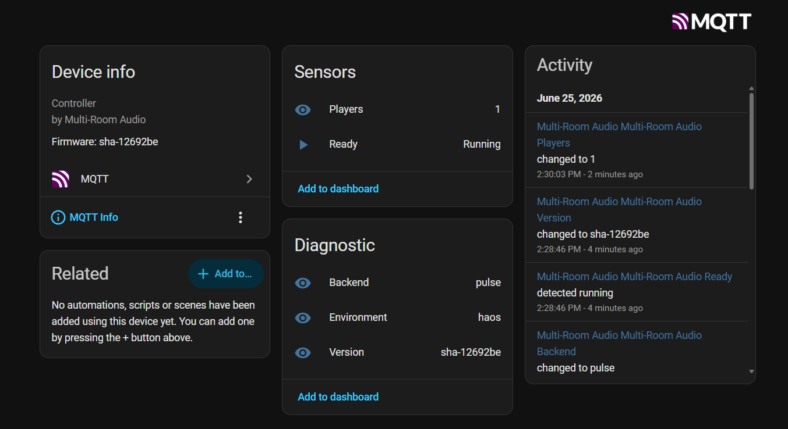
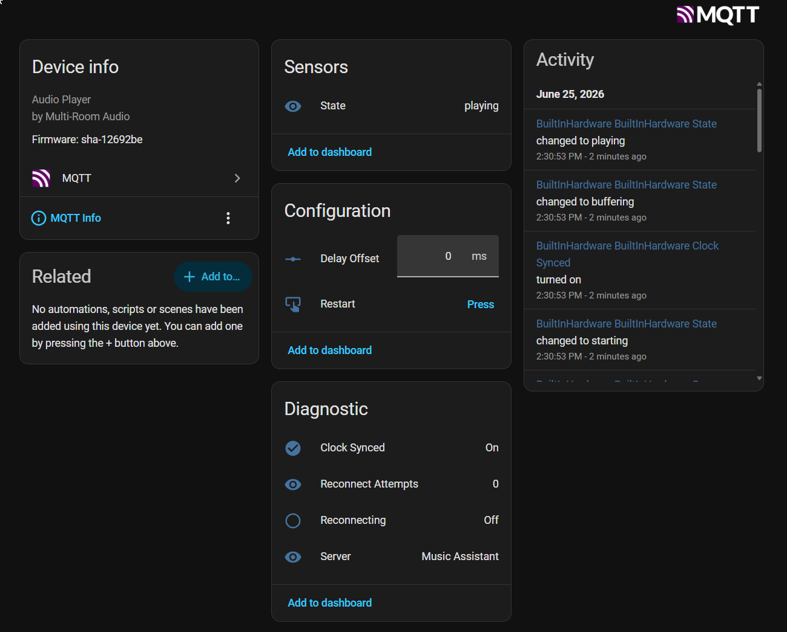
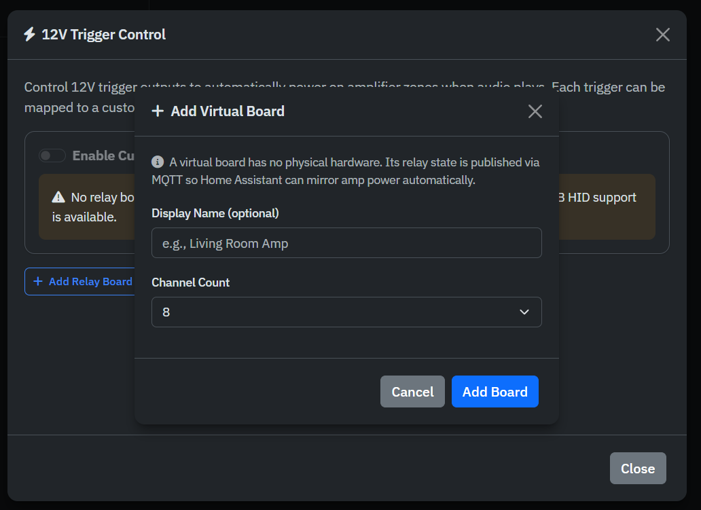

# Home Assistant MQTT Bridge

Expose Multi-Room Audio to Home Assistant over MQTT — player diagnostics, a few controls Music Assistant doesn't offer, and full control of your 12V amplifier zones (including amps driven by a Home Assistant smart plug).

## Overview

Your players already appear in Home Assistant as `media_player` entities through Music Assistant. The MQTT bridge is **complementary** — it surfaces the things Music Assistant *doesn't*:

- **Per-player diagnostics** — connection state, sync health, reconnection status — plus a couple of controls (delay-offset, restart).
- **Container health** — version, player count, audio backend, environment.
- **Amplifier zones** — power status, a manual-override switch, and a **virtual relay board** so an amp on an HA-controlled smart plug can be powered by playback automatically.

Everything is published using **MQTT Discovery**, so entities and devices appear in Home Assistant automatically — no YAML in HA required.

> The bridge does **not** duplicate volume, mute, or transport controls — Music Assistant already owns those on the `media_player` entity.

## Requirements

- An MQTT broker reachable from the add-on/container — typically the **Mosquitto broker** add-on in Home Assistant.
- The MQTT integration set up in Home Assistant (for Discovery to create the devices).

## Enabling the bridge

The bridge is **off by default**. Settings resolve with this precedence: **environment variable → Home Assistant add-on option → `mqtt.yaml` → built-in default**.

### Home Assistant OS (add-on)

Open the add-on's **Configuration** tab and set:

| Option | Description |
|--------|-------------|
| `mqtt_enabled` | Turn the bridge on |
| `mqtt_host` | Broker hostname/IP (e.g. `core-mosquitto`) |
| `mqtt_port` | Broker port (`1883` plain, `8883` TLS) |
| `mqtt_username` / `mqtt_password` | Broker credentials (leave blank for anonymous) |
| `mqtt_tls` | Enable TLS |

Save and restart the add-on. (If you don't see these options after updating, the add-on needs to be **rebuilt/updated** so Home Assistant re-reads its configuration schema — a plain restart won't refresh it.)

### Docker

Set environment variables:

```bash
docker run -d --name multiroom-audio \
  -p 8096:8096 --device /dev/snd:/dev/snd \
  -e MQTT_ENABLED=true \
  -e MQTT_HOST=192.168.1.10 \
  -e MQTT_PORT=1883 \
  -e MQTT_USERNAME=mqtt_user \
  -e MQTT_PASSWORD=secret \
  ghcr.io/chrisuthe/multiroom-audio:latest
```

| Variable | Default | Description |
|----------|---------|-------------|
| `MQTT_ENABLED` | `false` | Enable the bridge |
| `MQTT_HOST` | — | Broker hostname/IP |
| `MQTT_PORT` | `1883` | Broker port |
| `MQTT_USERNAME` | — | Broker username |
| `MQTT_PASSWORD` | — | Broker password |
| `MQTT_TLS` | `false` | Use TLS |
| `MQTT_DISCOVERY_PREFIX` | `homeassistant` | Home Assistant discovery prefix |
| `MQTT_BASE_TOPIC` | `multiroom-audio` | Root topic for state/command topics |

## What gets exposed

### Controller (hub) device

A single device representing the container/add-on itself.



| Entity | Type | Notes |
|--------|------|-------|
| Ready | binary_sensor | `Running` once all startup phases complete |
| Players | sensor | Number of configured players |
| Version | sensor | Build version (diagnostic) |
| Backend | sensor | Audio backend, e.g. `pulse` (diagnostic) |
| Environment | sensor | `haos` or `standalone` (diagnostic) |

### Per-player device

One device per audio player.



| Entity | Type | Notes |
|--------|------|-------|
| State | sensor | `playing`, `buffering`, `connected`, `waitingfordevice`, … |
| Delay Offset | number | Per-player sync trim, −5000…5000 ms → adjusts the player offset |
| Restart | button | Restart/reconnect a stuck player |
| Clock Synced | binary_sensor | Whether the player's clock is locked (diagnostic) |
| Reconnect Attempts | sensor | Count since last disconnect (diagnostic) |
| Reconnecting | binary_sensor | Reconnection in progress (diagnostic) |
| Server | sensor | Connected Music Assistant server (diagnostic) |

These make automations like *"notify me if the patio player drops off Music Assistant"* or *"auto-restart a zone that's stuck reconnecting"* straightforward.

### Amplifier zone devices

One device per 12V trigger channel (across **all** board types — HID, FTDI, Modbus, LCUS, and Virtual). See [12V Triggers](12V-TRIGGERS) for the hardware side.

| Entity | Type | Notes |
|--------|------|-------|
| Power | binary_sensor | Whether the amp/relay for this zone is on (`device_class: power`) |
| Scheduled Off | sensor | When the off-delay timer will switch the amp off (timestamp) |
| Override | switch | **Sticky manual override** — see below |
| Board Connected | binary_sensor | Relay board connectivity (diagnostic) |

#### Manual override (sticky)

The **Override** switch lets you grab manual control of a zone from Home Assistant:

- **On** — forces the amp on and **suspends** the playback auto-logic for that channel (it won't auto-power-off while overridden).
- **Off (release)** — hands control back to the auto-logic: the amp stays on if a player is currently active on that zone, otherwise it powers off after the normal off-delay.

Use it for *"keep the amp on for an hour"* scenes, or to manually power a zone for a non-Multi-Room source.

## Virtual relay board (amp on a smart plug)

A **virtual board** is a software relay with no physical hardware. It participates in the trigger pipeline exactly like a real board — you assign a custom sink and an off-delay — but instead of switching a USB relay, it **publishes its power state over MQTT**. Home Assistant can then mirror that onto any HA-controlled outlet (smart plug, Zigbee/Z-Wave relay, etc.), so an ordinary amp powers on/off with playback.

### Add a virtual board

In the web UI, open **12V Trigger Control → Add Relay Board → Add Virtual Board**, give it a name and channel count:



Then assign a custom sink and off-delay to a channel like any other board. The zone appears in Home Assistant as an amplifier-zone device (above), and its **Power** binary_sensor reflects playback.

### Bridge it to your outlet

Write one Home Assistant automation per zone — when the zone's power turns on/off, switch your outlet:

```yaml
automation:
  - alias: "Living Room amp follows Multi-Room"
    trigger:
      - platform: state
        entity_id: binary_sensor.living_room_amp_power
        to: "on"
        id: amp_on
      - platform: state
        entity_id: binary_sensor.living_room_amp_power
        to: "off"
        id: amp_off
    action:
      - choose:
          - conditions: "{{ trigger.id == 'amp_on' }}"
            sequence:
              - service: switch.turn_on
                target: { entity_id: switch.living_room_outlet }
          - conditions: "{{ trigger.id == 'amp_off' }}"
            sequence:
              - service: switch.turn_off
                target: { entity_id: switch.living_room_outlet }
```

This keeps Multi-Room broker-agnostic — it works with any outlet Home Assistant can control, regardless of the outlet's underlying protocol.

> A virtual board only does anything while MQTT is connected. If the bridge is disabled or the broker is unreachable, the zone's entities go **unavailable** in Home Assistant (see Availability below).

## Availability

The bridge uses an MQTT **Last Will & Testament**: a single availability topic backs every entity. If the add-on stops or the broker connection drops, Home Assistant automatically marks all Multi-Room entities **unavailable** — so you never see stale "playing"/"on" states, and it's the clearest signal that the bridge isn't reaching HA.

## Topics (reference)

You normally never touch these — Discovery wires everything up — but for debugging with `mosquitto_sub`:

| Topic | Purpose |
|-------|---------|
| `homeassistant/#` | Retained Discovery configs (prefix configurable) |
| `multiroom-audio/bridge/availability` | `online` / `offline` (LWT) |
| `multiroom-audio/player/<id>/state` | Per-player state JSON |
| `multiroom-audio/amp/<board>_<channel>/state` | Per-zone state JSON |
| `multiroom-audio/.../set` | Command topics (offset, restart, override) |

## Troubleshooting

### Options don't appear in the add-on Configuration tab
Home Assistant only refreshes an add-on's config schema on **update/reinstall**, not a plain restart. Rebuild/update the add-on after upgrading.

### Bridge connects then immediately disconnects in a loop
Each MQTT client needs a unique client ID; the bridge uses a unique ID per start. If you still see a connect/disconnect loop, check your broker log for *"client … already connected, closing old client"* — that means **two clients are sharing an ID**, usually a second instance of the add-on/container connecting to the same broker. Run only one instance, or point them at different brokers.

### Entities don't appear in Home Assistant
1. Confirm the **MQTT integration** is set up in Home Assistant and points at the same broker.
2. Check the add-on log for `MQTT bridge connected to broker`.
3. Verify the host/port/credentials, and that the discovery prefix matches your HA MQTT setting (default `homeassistant`).

### Entities show as "unavailable"
The bridge isn't connected (add-on stopped, broker unreachable, or wrong credentials). Check the add-on log and broker.

## Links

- [12V Triggers](12V-TRIGGERS) — relay hardware and zone setup
- [Custom Sinks](CUSTOM_SINKS) — the sinks that drive trigger zones
- [HAOS Add-on Guide](HAOS_ADDON_GUIDE)
